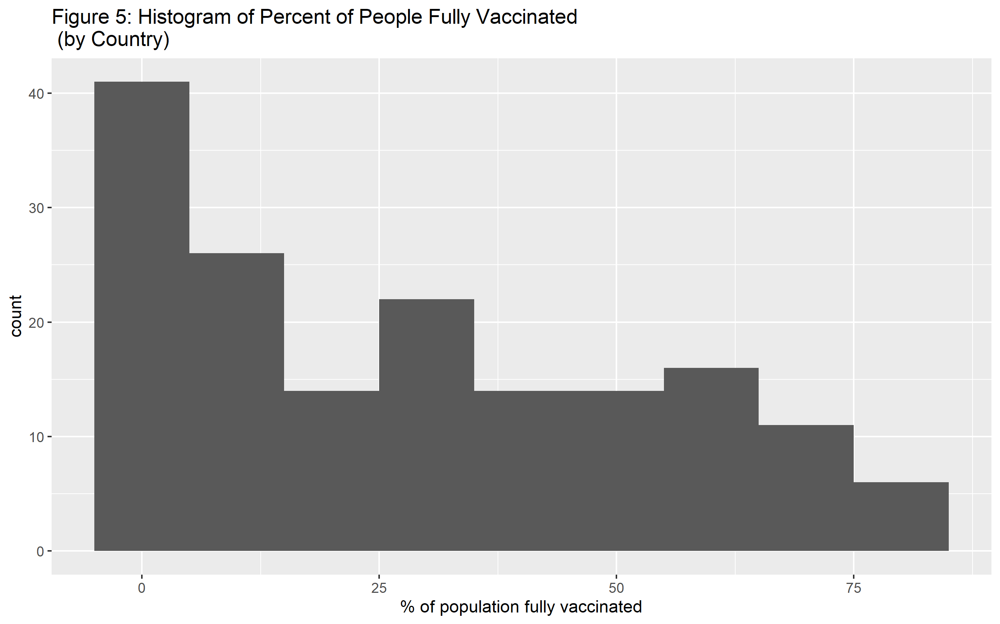

# Summary/Abstract
_Write a summary of your project._


# Introduction 

## General Background Information
COVID-19 hit the world by storm and is a possible ever-lasting change to the way society acts. It also had an impact on each countries funding towards health care. Actions within the past two years have been taken to help fight against this virus. 

## Description of data and data source
The data I plan on using is from a mixture of locations. Two sources are from kaggle.com and the other is from the Organisation for Economic Co-operation and Development (OECD) website. My data consists of eight data sets with information over each country in the world (for those that data was collected for). Six of these data sets provide the same information just for different countries where each data set is a different region. There is a data set that includes all of the countries but I want to include a region indicator variable for each country. These data sets includes total covid-19 cases, active cases, total deaths, total recovered, total tests, and population size. This data was updated on kaggle as of Sept 16th. Another data set I am using is a vaccination data set for each country. This is also data as of Sept. 16th. Finally, the last data set is of each countries healthcare funding for the past 4-5 years. Some countries provide 2020 data but others only provide up to 2019.

I plan on combining the data sets into one with the variable combining them all is the country. If there are missing data within the variables used in analysis, I will exclude those countries. Ill have to change the raw data as one data set uses 3 letter abbreviations for countries while the others use the whole name of the country. There will be a lot of cleaning for this data just to make it as I want it.

I included 3 data sets out of the 8 within the processingscript for now because one shows the same information as the other data sets not included just in a different region of the world. This is just to show the data I will be using.  

I plan on trying to find more information/data sets about some demographics data for the countries like type of government and an indicator for developed vs. developing countries.

Links to the locations I received the data are below:

https://data.oecd.org/healthres/health-spending.htm

https://www.kaggle.com/iamsouravbanerjee/covid19-dataset-world-and-continent-wise?select=Covid+Data+-+World.csv

https://www.kaggle.com/anandhuh/latest-worldwide-vaccine-data

## Questions/Hypotheses to be addressed
Since this data is cumulative and does not break down the amount of cases per month per country, I want to compare the recovery proportion to the death proportion and if this difference is based on variables such as the number of vaccines pushed out to society, the amount of funding the health care system has, the amount of tests taken. I also plan on adding more information as state in the description of data section. This will hopefully show if the amount of health care support really helps patients recover.

Some issues I can run into are: 
1) Developed countries might have more cases as they are in contact with the world more as travelers commonly travel to certain countries. Therefore could show an inverse relationship to what I expect with more developed countries have more recoveries. 
2) Unknown dates of when a country received vaccines and amount.

# Methods and Results

_In most research papers, results and methods are separate. You can combine them here if you find it easier. You are also welcome to structure things such that those are separate sections._


## Data import and cleaning
For the data importing and cleaning section, I first had to import 8 different data sets into R from multiple sources specified in the Description of data and data source. After this importation, The first thing to do before combing the data set was to create indicator variables for each country. After this I wanted to make sure that each variable was the right class as some of the numeric variables were character variables. This will help in making sure that each variable was able to be used in the right way. 

I then was able to combine each continent data set into one world data set to make the importing go easier. After combining the data sets, I need to only include the variable for each data set needed for analysis and make sure that all na values were removed from each data set as I only want full information observations. However this would delete some countries that were large in population such as China and Phillipines as they did not have vaccine information.

The last problem I ran into was that the country names for all datasets were different. One included a three letter code for countries, then another one used different abbreviations/names for countries. I had to use the countrynames package to help change into names I wanted. Since I could not change all of the countries names to the way I wanted it, I had to unfortunately go into the raw data csv files to change them manually. After all of this was good to go, I used the merge function to combine all of the data sets the way I wanted to. 

One disclosure I have for this is that one data set, health care funds, only had 48 countries when I cleaned the data. Therefore, there are a lot of na values for only those specific variables that came from the health care funds data set in the merged one. 

To look at a more descriptive explanation of all of the steps I took in data cleaning and importing, go to the processing script where it has comments for every line of code. 


## Exploratory analysis


Table \@ref(tab:summarytable) shows a table summarizing the data.


```{r summarytable,  echo=FALSE}
resulttable=readRDS("../../results/summarytable.rds")
knitr::kable(resulttable, caption = 'Data summary table.')
```

Table \@ref(tab:table1) shows a table of the top 10 countries with the highest percentage of cases by population. We can see that there are a variety of locations and that Montenegro and Czech Republic are the highest 2 countries with the most cases by population.


```{r table1,  echo=FALSE}
tab1=readRDS("../../results/table1.rds")
knitr::kable(tab1)
```

Table \@ref(tab:table2) shows a table of the top 5 and bottom 5 recovery rates also sharing the total cases numbers.It looks that Asia dominates the top 5 countries for recovery rate. For the bottom 5, there is a mixture of locations. We can also see that the recovery rate and death rate for the bottom 5 teams do not add up to 100 or close to it. This means there are a lot of active cases. 


```{r table2,  echo=FALSE}
tab2=readRDS("../../results/table2.rds")
knitr::kable(tab2)
```

Table \@ref(tab:table3) shows a table  of the top 5 and bottom 5 countries for death rate. We can see that Vanuatu only has a total of 4 cases but Yemen also has a significantly large rate then the next top country, Mexico. We can also see that Asia dominates the lowest death rates. 


```{r table3,  echo=FALSE}
tab3=readRDS("../../results/table3.rds")
knitr::kable(tab3)
```


Figure \@ref(fig:figure1) shows a scatterplot figure  of total cases by population. United States, India, and Brazil are some outliers of the countries.

```{r figure1,  fig.cap='Analysis figure.', echo=FALSE}
knitr::include_graphics("../../results/figure1.png")
```

Figure \@ref(fig:figure2) shows a scatterplot figure of total cases by population filtered down to countries with less than 40 mllion population. We can see that the total cases are spread out. 

```{r figure2,  fig.cap='Analysis figure.', echo=FALSE}
knitr::include_graphics("../../results/figure2.png")
```

Figure \@ref(fig:figure3) shows a scatterplot figure of total recovered patients by total cases. We can see just like in figure 1 that the United States, India, and Brazil have a overwhelmingly more cases than other countries. Therefore in figure 4, we will explore the majority of the countries.

```{r figure3,  fig.cap='Analysis figure.', echo=FALSE}
knitr::include_graphics("../../results/figure3.png")
```

Figure \@ref(fig:figure4) shows a scatterplot figure of the same plot as before just filtering countries with less than 20 million cases. We can see a linear relationship between the recovered to total cases. It looks like a slope of 1. 

```{r figure4,  fig.cap='Analysis figure.', echo=FALSE}
knitr::include_graphics("../../results/figure4.png")
```

Figure \@ref(fig:figure5) shows a histogram figure of the percent of fully vaccinated people. We can see that the histogram is right skewed where most of the countries have less than 25% of the population fully vaccinated. 

```{r figure5,  fig.cap='Analysis figure.', echo=FALSE}

```

Figure \@ref(fig:figure6) shows a scatterplot figure of percent of people fully vaccinated by health care funding. We can see that it is a linear relationship with a positive correlation. Wecan also see that the United States is out of the norm where they spend a lot more on health care funding compared to the percent of people fully vaccinated. 

```{r figure6,  fig.cap='Analysis figure.', echo=FALSE}
knitr::include_graphics("../../results/figure6.png")
```


## Full analysis

_Use one or several suitable statistical/machine learning methods to analyze your data and to produce meaningful figures, tables, etc. This might again be code that is best placed in one or several separate R scripts that need to be well documented. You want the code to produce figures and data ready for display as tables, and save those. Then you load them here._


# Discussion

## Summary and Interpretation
_Summarize what you did, what you found and what it means._

## Strengths and Limitations
_Discuss what you perceive as strengths and limitations of your analysis._

## Conclusions
_What are the main take-home messages?_

_Include citations in your Rmd file using bibtex, the list of references will automatically be placed at the end_


# References


