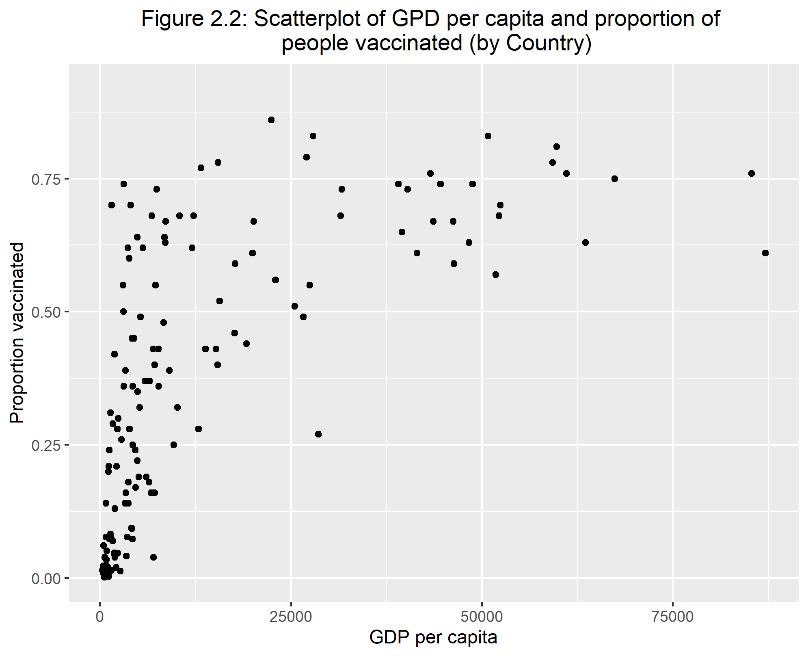
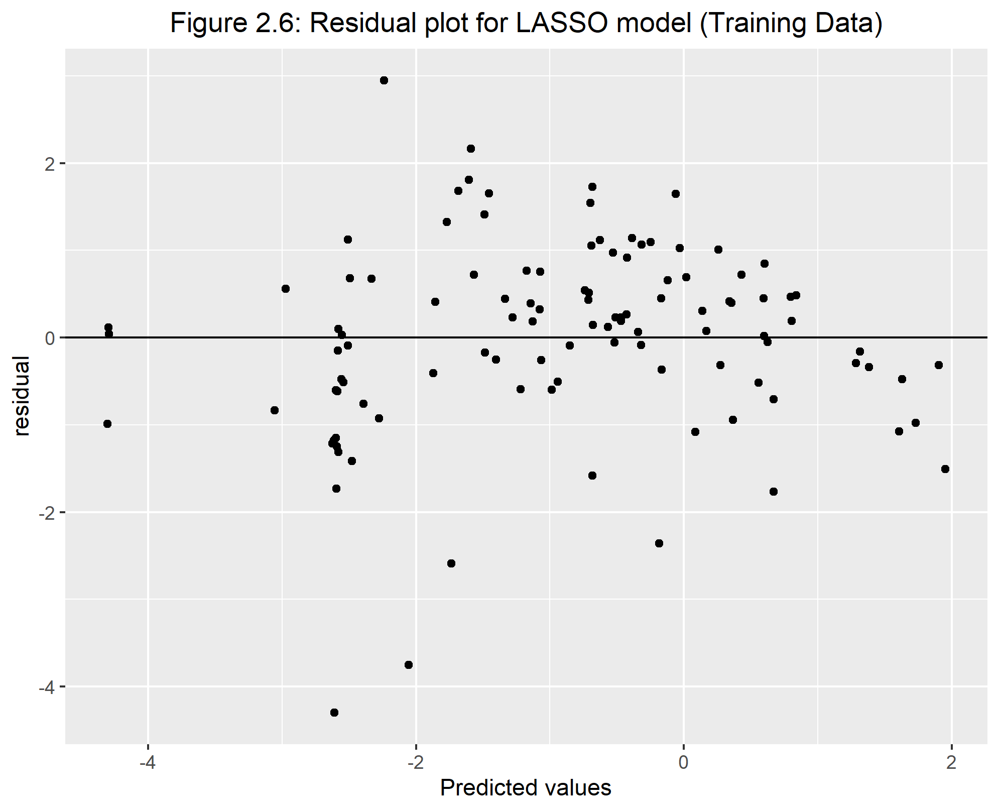
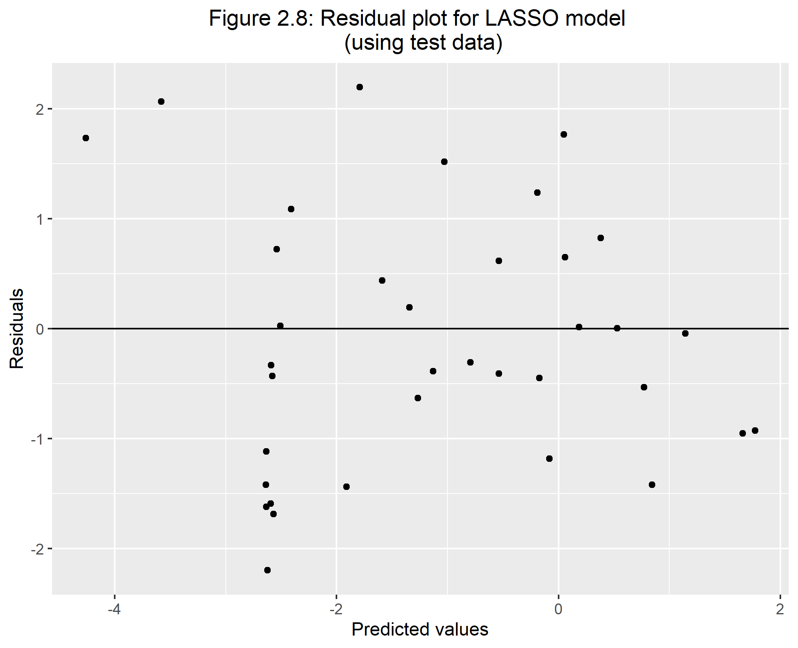

# Abstract
COVID-19 has been the talk of the world for the past two years, and it is still prevalent. The affects of COVID-19 not only affected individual people, but it also affected businesses, health protocols, and the economy of governments. It has affected all countries not only specific to a type of country which is the scary part. It is truly indeed a pandemic.

I am interested in looking at the difference between the proportion of those who recovered to those who have died for each country in the world. I am also looking at how the proportion of people vaccinated in each country is affected by multiple factors. The predictors I will be considering are: percent of cases within a population, continent the country is on, number of tests per person, gdp per capita, proportion of those who died, government type, and health care funds.

By looking at some simple linear regressions and other exploratory analysis, I determined due to how high the recovery rate is within each country overall and no association based on R-squared values, the difference in proportions did not change based on multiple factors.

While looking at vaccination proportions, I decided to do some analyses using training/test data sets and applying them to find the RMSE of the full model and a null model. When finding the RMSE, I found that the full model does a better job in fitting the data compared to the null model. This is a good sign to share that some combination of predictors have an association to the proportion of vaccinated people for each country. 

The next analysis was creating a machine learning modeling technique called the LASSO model. This type of modeling will create multiple models from a five-fold cross-validation and a tuning grid which will try to find the best performing model. From the LASSO we find that model 25 give the best model. 

**Need to find a way to extract this model**


# Introduction 

## General Background Information
COVID-19 hit the world by storm and is a possible ever-lasting change to the way society acts. It also had an impact on each countries funding towards health care. Actions within the past two years have been taken to help fight against this virus. Although COVID-19 has been here for over two year, there is still problems with under staffing in hospitals and not enough beds at some hospitals. Recovery rates are still high in the United States but what about the whole world. Other countries are still getting hit hard by this virus. In terms of vaccination output, there has been recent back and forth movements on people getting the vaccination. Although in developed countries this happens but what about the less developed countries and regions such as Africa. While people in the United States are fighting about whether the vaccine should be given or not, the people in these other countries might have a limited supply. 

Looking at the difference in recovered patients and those who have died will be beneficial in determining if more care is needed in certain countries. I also think the percentage of people vaccinated is also affected and can lead to important results that might show we need more either distribution or requirements of the vaccines.

## Description of data and data source
The data I am using is from a mixture of locations. Two sources are from kaggle.com, one from the world bank database, one created by myself based on information from wikipedia, and the other is from the Organisation for Economic Co-operation and Development (OECD) website. My data consists of ten data sets with information over each country in the world (for those that data was collected for). Six of these data sets provide the same information just for different countries where each data set is a different region. There is a data set that includes all of the countries but I want to include a region indicator variable for each country. These data sets includes total covid-19 cases, active cases, total deaths, total recovered, total tests, and population size. This data was updated on kaggle as of Sept 16th. Another data set I am using is a vaccination data set for each country. This is also data as of Sept. 16th. The other data sets are providing single stats for each country that was not included in the larger data sets but I still wanted to use. These data sets include the following statistics/demographics: healthcare funding for 2019-2020, vaccination numbers/percentages, gdp per capita, and government type. 

I plan on combining the data sets into one with the variable combining them all is the country. If there are missing data within the variables used in analysis, I will exclude those countries. There will be a lot of cleaning for this data just to make it as I want it and work.


Links to the locations I received the data are below:

https://data.oecd.org/healthres/health-spending.htm

https://www.kaggle.com/iamsouravbanerjee/covid19-dataset-world-and-continent-wise?select=Covid+Data+-+World.csv

https://www.kaggle.com/anandhuh/latest-worldwide-vaccine-data

https://data.worldbank.org/indicator/NY.GDP.PCAP.CD

https://en.wikipedia.org/wiki/List_of_countries_by_system_of_government


## Questions/Hypotheses to be addressed
1) Since this data is cumulative and does not break down the amount of cases per month per country, I want to compare the recovery proportion to the death proportion and if this difference is based on variables such as the number of vaccines pushed out to society, the amount of funding the health care system has, the amount of tests taken. This will hopefully show if the amount of health care support really helps patients recover.

2) I will also look at how the percent of people vaccinated for each country is affected by multiple predictors. I am planning on seeing that more developed countries based on GDP per capita will have a more vaccinated population.

Some confounders that I could run into are: 
1) Developed countries might have more cases as more travelers visit these countries and it could have an effect on recovery numbers.

2) Unknown dates of when a country received vaccines and amount. This could skew the amount of vaccinations a country receives.

# Methods and Results

## Data import and cleaning
For data importing and cleaning, I first had to import ten different data sets into R from multiple sources specified in the Description of data and data source. After this importation, The first thing to do before combining the data set was to create indicator variables for each country. After this, I wanted to make sure that each variable was the right class as some of the numeric variables were character variables. This will help in making sure that each variable was able to be used in the right way. I then was able to combine each continent data set into one world data set to make the importing go easier. After combining the continent data sets, I need to only include the variables from the world data set needed for analysis and make sure that all missing values were removed as I only want full information observations. However this would delete some countries that were large in population such as China and the Philippines as they did not have vaccine information.

The next part was looking at all of the other datasets which include the government type, gdp per capita, health care funds, and vaccine datasets. To combine these with the world data set, there was a huge problem that goes with using data sets from different sources. This problem is how to combine the data sets with a specific variable. Fortunately, each data set had a country variable to combine them with. However, the country names for all datasets were different. One included a three letter code for countries, then another ones used different abbreviations/names for countries. I had to use the countrynames package to help change into names I wanted for the three-letter code. Since I could not change all of the countries names to the way I wanted it, I had to unfortunately go into the raw data csv files to change them manually for some of the continent specific data sets. I also used `ifelse` statements to change the names for the gdp per capita and health care funds data sets. I was able to do these in r because there were not as many country names to change compared to the other data sets I had to manually change. A comment within the proccessingscript.R tell of the countries that needed manual changes. After all of this was good to go, I used the merge function to combine all of the data sets the way I wanted to. 

I created some variables from the pre-existing ones that I will use within my analysis. Some of these changes were, for example, creating proportions from percentages and combining two variables. 

One disclosure I have for this is that one data set, health care funds, only had 48 countries when I cleaned the data. Therefore, there are a lot of missing values for only the specific variables that came from the health care funds data set in the merged one. 

To look at a more descriptive explanation of all of the steps I took in data cleaning and importing, go to the processing script where it has comments for every line of code. 

## Full analysis


### Difference in proportions of recovery and deaths

Table 1.1 displays the top five and bottom five death rates. Also within this, it shows their corresponding recovery rates as well. We can see that the bottom five death rates are from Asia but also the highest, Yemen, is also within the Asia continent as well. 

Table 1.1
```{r table1,  echo=FALSE}
tab1=readRDS("../../results/table3.rds")
knitr::kable(tab1)
```

Figure 1.1 shows a histogram figure that describes the difference in proportions between those who recovered versus the proportion of those who died. From the histogram we can see that this difference is left skewed as most countries have a much higher recovery rate with only a some having more of a lower difference meaning lower recovery rates. This is very worrisome for the analysis as most of the countries are over 0.80 in the difference. 

```{r figure 1.1,  fig.cap='Analysis figure.', echo=FALSE}
knitr::include_graphics("../../results/prop_diff_recov_died.png")
```


We can see in figure 1.1 that this data is fairly skewed. Therefore, I will do a logit transformation of the outcome to make it more normal as shown in figure 1.2. 

```{r figure 1.2,  fig.cap='Analysis figure.', echo=FALSE}
knitr::include_graphics("../../results/log_prop_diff_hist.png")
```

Before I decided on the logit transformation, I first decided to try this difference in proportions outcome I made within a binomial model and then a quasibinomial using the values of total cases as my weight to see how the deviance and dispersion values are. After running two simple models, the results were showing very high values for these statistics. Therefore this is how I decided on using the logit transformation. 

Using the logit transformation, I ran 4 simple linear regression models. Below I provide the statistics of each of the models within Tables 1.2-1.5.

Table 1.2 is showing statistics for the predictor vaccine percentage.

Table 1.2
```{r table 1.2,  echo=FALSE}
tab2=readRDS("../../results/tablevacc1.rds")
knitr::kable(tab2)
```

Table 1.3 is showing statistics for the predictor health care funds.

Table 1.3
```{r table 1.3,  echo=FALSE}
tab3=readRDS("../../results/tablehc1.rds")
knitr::kable(tab3)
```

Table 1.4 is showing statistics for the predictor number of tests per person.

Table 1.4
```{r table 1.4,  echo=FALSE}
tab4=readRDS("../../results/tabletests1.rds")
knitr::kable(tab4)
```

Table 1.5 is showing statistics for the predictor location which specifies the continent for each country.

Table 1.5
```{r table 1.5,  echo=FALSE}
tab5=readRDS("../../results/tableloc1.rds")
knitr::kable(tab5)
```

Looking at all of these tables, we can see that the R^2 values are very low. Therefore none of these predictors shows any association with the logit transformation outcome. Since not even one predictor is good for this outcome, I am going to stop my analysis with this outcome and go to my second question which uses the percent of cases within each country.


### Percent of people vaccinated for each country

#### Methods

For my main analysis, I will be using the logit transformation of the proportion of people vaccinated within each country as my main outcome. Since I am using the logit transformation, I am creating another data set that is a subset of the overall data set that only includes the variables I will be using for my analysis. The predictor variables I will be testing out on the main outcome are: percent of cases within a population, continent the country is on, number of tests per person, gdp per capita, proportion of those who died, government type, and health care funds. These will create my full model. 

The first part of my main analysis will be using test/training data and finding the RMSE for both the full model and the null model which only include a intercept. This is just to see if using a full model is better than the null model.

After comparing the two RMSE, I will be going into more detail on model fitting and tuning. I will be applying my full model a machine learning model, the LASSO model. This will help find the best model I can use for the predictors in predicting the logit transformation of the proportion of people vaccinated. I will be applying this lasso model to both my test and training data created before to make sure the model fits both data sets similarly so show improvement on over-fitting. 


#### Exploratory Analysis

Table 2.1 displays percentage of people vaccinated within the top five and bottom five countries. Just by the look of the countries displayed, the less developed countries tend to not have a lot of people vaccinated. It is honestly kind of scary to see some countries are not vaccinated at all or very low.

Table 2.1
```{r table 2.1,  echo=FALSE}
tab21=readRDS("../../results/vacc_tab.rds")
knitr::kable(tab21)
```


Figure 2.1 shows a histogram figure of the percent of vaccinated people. We can see that the histogram is right skewed with the spike around the percentages of 0%. 

```{r figure 2.1,  fig.cap='Analysis figure.', echo=FALSE}

```

Figure 2.2 shows that there is no trend between vaccinations and cases until you get out to over 10% of the population had cases of COVID-19. The vaccination numbers range a lot when there is a low perecentage of cases compared to the countries population.  

```{r figure 2.2,  fig.cap='Analysis figure.', echo=FALSE}
knitr::include_graphics("../../results/cases_vs_vacc.png")
```

When looking at Figure 2.3, we can see that those countries who have large values of GDP per capita, their population is more vaccinated. The vaccination number, just like in Figure 2.2, varies when the GDP per capita is relatively low. 

```{r figure 2.3,  fig.cap='Analysis figure.', echo=FALSE}

```

Looking at Figure 2.4, this side-by-side boxplot shows that Africa is significantly different to all of the other continents. Africa is historically known is a less developed continent. This could be result in lower supplies to Africa compared to other places in the world. Within the other continents, Europe seems to have th highest median vaccinated proportions. 

```{r figure 2.4,  fig.cap='Analysis figure.', echo=FALSE}
knitr::include_graphics("../../results/loc_vs_vacc.png")
```

Figure 2.5 is showing the logit transformation of the proportion of the population vaccinated. This is due to the skewness of the non-transformed vaccinatio numbers. We see that this is still skewed but its skewed left where most of the data is around that 0 value.  

```{r figure 2.5,  fig.cap='Analysis figure.', echo=FALSE}
knitr::include_graphics("../../results/log_vacc.png")
```


#### Main Analysis

As specified within the methods section, the first part of my analysis will be comparing the RMSE of my full model to the null model. However, before I do this I will run a correlation matrix of the numberic variables to see if some variables are highly correlated.

In Table 2.2 we can see that the two variable, which I suspected, that are highly correlated are health care funds and GDP per capita where value is the health care fund variable. Since those two variables are highly correlated and the health care funds variable only includes 48 observations, I will remove health care funds out of the full model.

Table 2.2
```{r table 2.2,  echo=FALSE}
tab22=readRDS("../../results/cor_tab.rds")
knitr::kable(tab22)
```

Now that I have my full model solidified, Table 2.3 shows the summary table and some other statistics of this full model. We can see that our adjusted R-sqaured value is around 0.64 and most of our factors are significant except the proportion of this who died and the COVID tests per person. 

Table 2.3
```{r table 2.3,  echo=FALSE}
tab23=readRDS("../../results/Summ_stat_mult_reg.rds")
knitr::kable(tab23)

tab232=readRDS("../../results/Multiple_Reg_tab.rds")
knitr::kable(tab232)

```

**Simple Comparison of RMSE**

To start comparing the full model to the null model in terms of RMSE, we need to create training and test data sets. I used a 0.75 split for the training set. I am working on this project using Tidyverse and Tidymodels packages which uses the functions of recipes and workflows. The recipe I am specifying is the creation of the model which in this case, I need to make two. One of the recipes is for the full model and the other is for the null model. Since my outcome is numeric, we need to specify the type of model as well which is linear regression for our project. Once we have our model type and our recipe, we can combine them and put it in a workflow. This workflow will be able to combine the two `settings` we have and create a fit object which eventually creates the statistics of our models and our predictors. However, since our main objective is looking at the fit of our data, we want to look at the RMSE.

We can fit our fit object with both our test and training sets to see how well it does for both data sets. A general consensus on RMSE is that models with a value close to 1 is good and those who go farther away in the positive direction have a worse fit. We want our test and train values to be similar as well as that shows the model does not overfit the training data and results in a lower fit on the test data. 

Table 2.4 shows the two values for the full model where the top is the training value and the bottom is the testing value. We can see that these two values are somewhat similar and possibly we want to a bit closer. However, these two values are relatively low which is a good sign.

Comparing Table 2.4 to Table 2.5, which shows the null models results, we can see our full model does a lot better than the null model. The RMSE is a lot worse for the null model. This is a good sign for the data as we now know that these predictors do have some type of association since it is way better than the null model. We can now proceed to creating our LASSO model and tuning this full model to find the best performing model.

Table 2.4
```{r table 2.4,  echo=FALSE}
tab24=readRDS("../../results/Logit_vacc_rmse_tab.rds")
knitr::kable(tab24)
```

Table 2.5
```{r table 2.5,  echo=FALSE}
tab25=readRDS("../../results/Logit_vacc_rmse_null_tab.rds")
knitr::kable(tab25)
```

**LASSO Model**

For the LASSO model, there is some preparation we need to run this. We will use cross validation to create the multiple models included in the LASSO model. This cross validation will be a 5-fold stratified by the outcome. We then, like previously, create a workflow using a specific model type and recipe. The recipe will be the full model recipe but the model type will be different. The LASSO model uses a specific model that has a tuning factor into a linear regression type. Once we have our workflow, we need to make a grid as the LASSO model created multiple models based on the 5-fold cross validation and other factors. From the workflow, we can apply a tuning grid to it. This will produce the variety of models. To find the best model, we an apply a function called show_best and specify RMSE to find the best model in terms of RMSE. After putting this model into a workflow and creating a fit object, we get the statistics of the best model. Figure 2.6 shows the tuning process in a visual. The best model is represented by the lowest RMSE within the dip. 

```{r figure 2.6,  fig.cap='Analysis figure.', echo=FALSE}
knitr::include_graphics("../../results/lasso_tune_process.png")
```

Figure 2.7 shows the predicted values to the observed values. Most of the points follow the trend and there seems to show no pattern. We can see this more within Figure 2.8 which is the residual plot. Within Figure 2.8, we could see a slight pattern at the begging points where they are grouped up more.

```{r figure 2.7,  fig.cap='Analysis figure.', echo=FALSE}
knitr::include_graphics("../../results/Pred_vs_obs_value_lasso_train.png")
```

```{r figure 2.8,  fig.cap='Analysis figure.', echo=FALSE}

```

The last part of the LASSO modeling analysis is fitting the model to the test data to see how well they both look together. To look at the test data results, we need to run a last fit function which just applies the test data to the best model found above. Figure 2.9 and Figure 2.10 show the predicted values versus observed and its residual plot for the test data. Just like the training test, most of the predicted values do have a similar trend and it close to the observed value. The residual plot shows that concerning line of observations for the lower values. This residual plot show more variability in the lower values more. Table 2.6 shows the RMSE values created from this LASSO model. We can see unfortunately these are overall higher and farther apart. It is still better than the null model.

```{r figure 2.9,  fig.cap='Analysis figure.', echo=FALSE}

```

```{r figure 2.10,  fig.cap='Analysis figure.', echo=FALSE}

```

Table 2.6
```{r table 2.6,  echo=FALSE}
tab26=readRDS("../../results/LASSO_rmse_train_tab.rds")
knitr::kable(tab26)

tab262=readRDS("../../results/LASSO_rmse_test_tab.rds")
knitr::kable(tab262)

```

# Discussion

## Summary and Interpretation
_Summarize what you did, what you found and what it means._

## Strengths and Limitations
_Discuss what you perceive as strengths and limitations of your analysis._

## Conclusions
_What are the main take-home messages?_

_Include citations in your Rmd file using bibtex, the list of references will automatically be placed at the end_


# References


