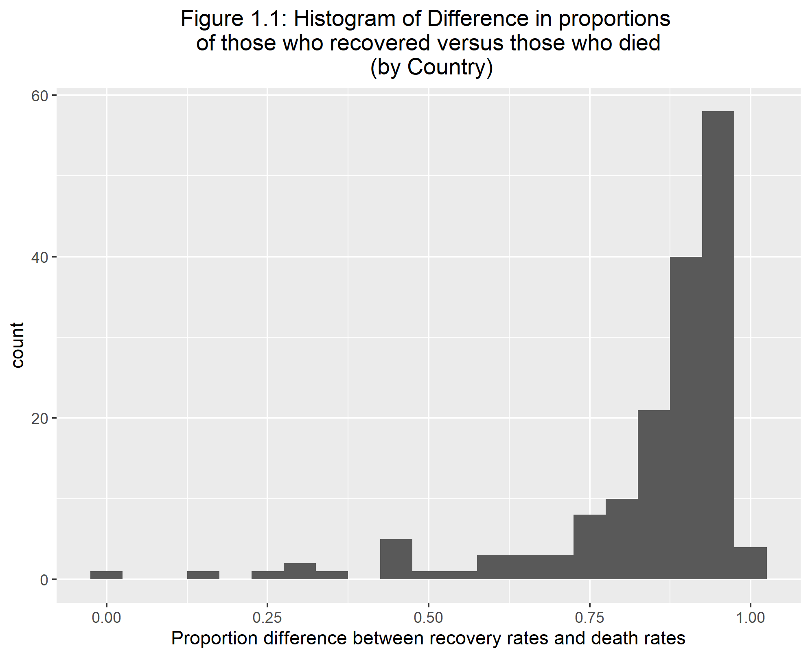
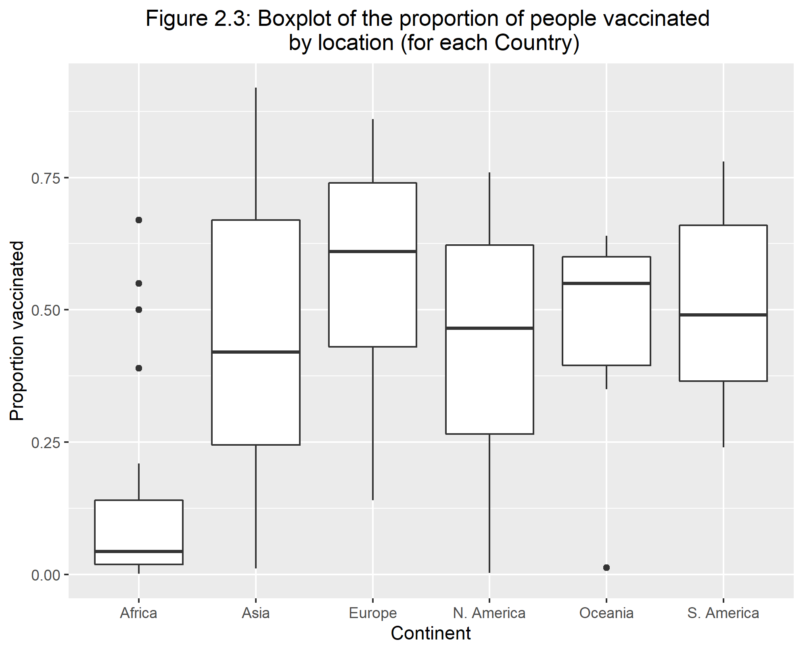
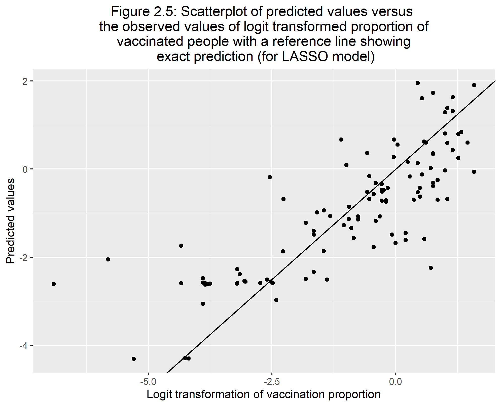

# Abstract
COVID-19 has been the talk of the world for the past two years, and it is still prevalent. COVID-19 not only affected individual people, but it also affected businesses, health protocols, and the economy of governments. All countries faced this impact no matter their location or how developed their country is. It is truly indeed a pandemic.

I am interested in looking at the difference between the proportion of those who recovered to those who have died for each country in the world. The variables I am considering are: percent of cases within a population, continent the country is on, number of tests per person, gdp per capita, proportion of those vaccinated, government type, and health care funds. By looking at some simple linear regressions and other exploratory analysis, the fit of the model to the data were not good for each simple linear regression. I decided to do a step-wise selection process, and found that the percent of cases and the continent the country resides in has an association to the difference in proportions. However, the fit is still not good at all. 

The higher the percent of cases there is in a country, the higher recovery proportion there is when keeping the continent constant. North American countries as a whole has a higher death proportion compared to African countries as a whole when keeping the percent of cases constant.

I am also looking at how the proportion of people vaccinated in each country is affected by multiple factors. The predictors I will be considering are: percent of cases within a population, continent the country is on, number of tests per person, gdp per capita, proportion of those who died, government type, and health care funds.

While looking at vaccination proportions, I decided to do some analyses using training/test data sets and applying them to find the RMSE of the full model and a null model. When finding the RMSE, I found that the full model does a better job in fitting the data compared to the null model. This is a good sign in showing that some combination of predictors have an association to the proportion of vaccinated people for each country. 

The next analysis was using a machine learning modeling technique called the LASSO model. This type of modeling will create multiple models from a five-fold cross-validation and a tuning grid which will try to find the best performing model. From the LASSO, we find that model 27 gives the best model, and the percentage of cases in a country, which continent the country resides in, and the type of government have impacts to the vaccination proportions. Compared to Africa, South America and Asia increases the proportion of vaccinations the most while an increase of cases means more vaccinations as well. A monarchy government compared to a republic government increases the proportion of people vaccinated.


# Introduction 

## General Background Information
COVID-19 hit the world by storm and is a possible ever-lasting change to the way society acts. It also had an impact on each country's funding towards health care. Actions within the past two years have been taken to help fight against this virus. Although COVID-19 has been here for over two years, there are still problems with under staffing in hospitals and not enough beds at some hospitals. Recovery rates are still high in the United States but what about the whole world. Other countries are still getting hit hard by this virus. In terms of vaccination output, there has been back and forth movements on people getting the vaccination. A poll, close to when vaccinations were starting to disperse, showed that only 51% of adults in the United States said they would get a vaccine [@choi21]. Although this happens in developed countries, what about the less developed countries and regions such as Africa. While people in the United States are fighting about whether the vaccine should be given or not, the people in these other countries might have a limited supply. According to the United Nations in September of 2021, there is still an unequal amount of vaccinations going to developed and less developed countries. This could be due to the cost of each vaccination [@UN21]. In a paper by Choi, as of January 2021, cases were fairly even between developed and less developed countries [@choi21]. This just shows that although COVID-19 is affected everyone, the supply is not equal between all countries. In a paper by Mathieu et al., they show a world map and the distribution of vaccines by country as of April of 2021. We can see that Africa is the continent that has the lowest distribution of vaccines [@mathieu21].

One of the goals of this analysis is to look at the difference in proportions of recovered patients and those who have died. This will be beneficial in determining if more care and funding is needed for countries. According to  paper by Liang et al., the mortality rates were negatively impacted by the number of tests performed and also based on the countries economic status and government [@liang20]. 

My other goal for this project is to analyze how the percentage of people vaccinated is affected. It could possibly lead to important results that might show that we need more either distribution or requirements of the vaccines. As mentioned above, there is a uneven distribution of vaccinations but is this significantly different and what other factors could affect vaccination numbers?  

## Description of data and data source
The data I am using is from a mixture of locations. Two sources are from kaggle.com, one from the world bank database, one created by myself based on information from wikipedia, and the other is from the Organisation for Economic Co-operation and Development (OECD) website. My data consists of ten data sets with information over each country in the world (for those that data was collected for). Six of these data sets provide the same information just for different countries where each data set is a different region. There is a data set that includes all of the countries but I want to include a region indicator variable for each country. These data sets includes total covid-19 cases, active cases, total deaths, total recovered, total tests, and population size. This data was updated on kaggle as of September 16, 2021. Another data set I am using is a vaccination data set for each country. This is also data as of September 16, 2021. The other data sets are providing statistics for each country that was not included in the larger data set but I still wanted to use. These data sets include the following statistics/demographics: healthcare funding for 2019-2020, vaccination numbers/percentages, gdp per capita, and government type. 

I combined the data sets into one using the countries name as the merging variable. If there are missing data within the variables used in analysis, I will exclude those countries. There will be a lot of cleaning for this data just to make it as I want it.

The variables I will be using in my analysis are:

* **prop_diff_recov_vs_death** - proportion of those who have recovered versus those who have died from COVID-19 (for those who has gotten COVID-19)
* **Value** - health care funds (in U.S. dollars)
* **prop_vacc** - proportion of those who are vaccinated (for the whole population of a country) 
* **pct_cases** - percent of the population in each country that has gotten COVID-19
* **location** - the continent in which the country resides in 
* **test_per_person** - the number of tests a person has taken (on average)
* **gdp_per_capita** - the gdp per capita for each country (in U.S. dollars)
* **prop_death** - proportion of those who have died from COVID-19 
* **government** - Type of government (Republic, Monarchy, or Provisional)


Links to the locations I received the data are below:

[https://data.oecd.org/healthres/health-spending.htm](https://data.oecd.org/healthres/health-spending.htm)

[https://www.kaggle.com/iamsouravbanerjee/covid19-dataset-world-and-continent-wise?select=Covid+Data+-+World.csv](https://www.kaggle.com/iamsouravbanerjee/covid19-dataset-world-and-continent-wise?select=Covid+Data+-+World.csv)

[https://www.kaggle.com/anandhuh/latest-worldwide-vaccine-data](https://www.kaggle.com/anandhuh/latest-worldwide-vaccine-data)

[https://data.worldbank.org/indicator/NY.GDP.PCAP.CD](https://data.worldbank.org/indicator/NY.GDP.PCAP.CD)

[https://en.wikipedia.org/wiki/List_of_countries_by_system_of_government](https://en.wikipedia.org/wiki/List_of_countries_by_system_of_government)


## Questions/Hypotheses to be addressed
1) Since this data is cumulative and does not break down the amount of cases per month per country, I want to compare the recovery proportion to the death proportion. I want to see if this difference is based on variables such as the proportion of those vaccinated, the amount of funding the health care system has, the amount of tests taken per person, the location of the country, the percent of cases in a country, the gdp per capita, and the government type. This will hopefully show if the amount of health care support really helps patients recover.

2) I will also look at how the percent of people vaccinated for each country is affected by multiple predictors (location of country, tests per person, government type, proportion of deaths, gdp per capita, and percent of cases per country). I am planning on seeing that more developed countries based on GDP per capita will have a more vaccinated population.

Some confounders that I could run into are:

1) Developed countries might have more cases as more travelers visit these countries and it could have an effect on recovery numbers.

2) Unknown dates of when a country received vaccines and amount. This could skew the amount of vaccinations a country receives.

# Methods and Results

## Data import and cleaning
For data importing and cleaning, I first had to import ten different data sets into R from multiple sources specified in the description of data and data source section. After this importation, the first thing to do before combining the data set was to create indicator variables for each country. After this, I wanted to make sure that each variable was the right class as some of the numeric variables were character variables. This will help in making sure that each variable was able to be used in the right way. I then was able to combine each continent data set into one world data set to make the importing go easier. After combining the continent data sets, I need to only include the variables from the world data set needed for analysis and make sure that all missing values were removed as I only want full observations. However this would delete some countries that were large in population such as China and the Philippines as they did not have vaccine information.

The next part was looking at all of the other datasets which include the government type, gdp per capita, health care funds, and vaccine datasets. To combine these with the world data set, there was a huge problem that goes with using data sets from different sources. This problem is how to combine the data sets with a specific variable. Fortunately, each data set had a country variable to combine them with. However, the country names for all datasets were different. One included a three letter code for countries and another one used different abbreviations/names for countries. I had to use the 'countrynames' package to help change into names I wanted for the three-letter code. Since I could not change all of the countries names to the way I wanted it, I had to unfortunately go into the raw data csv files to change them manually for some of the continent specific data sets. I also used `ifelse` statements to change the names for the gdp per capita and health care funds data sets. I was able to do these in r because there were not as many country names to change compared to the other data sets I had to manually change. A comment within the proccessingscript.R tells of the countries that needed manual changes. After all of this was good to go, I used the merge function to combine all of the data sets the way I wanted to. 

I created some variables from the pre-existing ones that I will use within my analysis. Some of these changes were, for example, creating proportions from percentages and combining two variables. These variables can described above in the description of data and data source section.

One disclosure I have for this is that one data set, health care funds, only had 48 countries when I cleaned the data. Therefore, there are a lot of missing values for only the specific variables that came from the health care funds data set in the merged one. 

To look at a more descriptive explanation of all of the steps I took in data cleaning and importing, go to the processing script where it has comments for every line of code. 


## Question 1: Difference in proportions of recovery and deaths

### Methods

For question 1's analysis, I first decided to do some simple exploratory analysis on the data. This included some simple linear regression models just to see how each variable fits with my outcome. After fitting most of the predictors to the outcome, I decided to look at a step-wise procedure which will hopefully create the best model for this data. Before fitting the variables into step-wise selection, I did a correlation matrix to see if some variables are very correlated. After considering the correlation matrix, the variables I considered in my analysis were the proportion of those vaccinated, tests per person, continent the country resides in, gdp per capita, government type, and percent of cases in a country as predictors. 

I used the caret package within R to do this step-wise procedure. After doing the step-wise procedure and finding which variables will stay in the model, I created that model just to see how well the model actual is. I created a predicted versus observed values scatterplot and a supplementary residual plot as well. These plots and the model model will help give me an idea of what variables are useful in predicting the difference in proportions of recovered people and people who have died.

### Exploratory Analysis

Table 1.1 displays the top five and bottom five death rates. Also within this, it shows their corresponding recovery rates as well. We can see that the bottom five death rates are from Asia but also the highest, Yemen, is within the Asia continent as well. Yemen has a much higher death rate compare to the other top countries. It is more than double the second highest. However, the sample size of total COVID-19 cases is smaller than others. 
<br /> 

Table 1.1: Top 5 and bottom 5 death rates by country
```{r table1,  echo=FALSE}
tab1=readRDS("../../results/table3.rds")
knitr::kable(tab1)
```

Figure 1.1 shows a histogram figure that describes the difference in proportions between those who recovered versus the proportion of those who died. From the histogram we can see that this difference is left skewed as most countries have a much higher recovery rate with only a some having more of a lower difference meaning lower recovery rates. This is very worrisome for the analysis as most of the countries are over 0.80 in the difference. 

```{r figure 1.1, echo=FALSE}

```


We can see in figure 1.1 that this data is fairly skewed. Therefore, I will do a logit transformation of the outcome to make it more normal as shown in figure 1.2. 

```{r figure 1.2, echo=FALSE}

```

Before I decided on the logit transformation, I first decided to try this difference in proportions outcome I made within a binomial model and then a quasibinomial using the values of total cases as my weight to see how the deviance and dispersion values are. After running two simple models, the results were showing very high values for these statistics. Therefore this is how I decided on using the logit transformation. 

Using the logit transformation, I ran 4 simple linear regression models. Below I provide the statistics of one of the models within Tables 1.2. Table 1.2 is showing statistics for the predictor vaccine percentage.

Table 1.2: Summary statistics for linear regression (logit transformation of prop diff of recovery and deaths vs. vaccine)


```{r table 1.2,  echo=FALSE}
tab2=readRDS("../../results/tablevacc1.rds")
knitr::kable(tab2)
```


Looking at Table 1.2, we can see that the R^2 values are very low, and the deviance is also somewhat high. This is a similar situation to all of the other simple linear regression models. The statistics for the other three models are within the supplemental material. Therefore none of these models are good fits to the data. I am going to see if a step-wise selection of predictors could increase the fit of the model to the data.

### Main Analysis

The main analysis pertains to using step-wise selection for the variables I specified within the methods section for question 1. I am doing step-wise selection because for each simple linear regression, the r-squared values are very small and I wonder how my model will do if I try to select the best variables in predicting the logit transformation of the difference in proportions between recovery and deaths. 

Table 1.3 shows the resulting model from the step-wise selection. If you want more details on this selection, there is a table showing the process of model selection within the supplementary material. We can see that the two variable that were selected using step-wise selection were percent of cases in a country and the location or continent the country is in. Although these two variables were selected and they are significant on at least one level, we can see that the fit according to R-squared is still very low.

Table 1.3
```{r table 1.3,  echo=FALSE}
tab13=readRDS("../../results/summ_stepwise_tab.rds")
knitr::kable(tab13)

tab132=readRDS("../../results/stepwise_stat_tab.rds")
knitr::kable(tab132)
```

This low fit can be shown within Figure 1.3 and Figure 1.4 where they show the predicted values versus observed values as well as the corresponding residual plot. The data points are spread out and it seems, within the residual plot, it shows a funnel shaped plot which means heteroskedasticity. Therefore, possibly more work could be done to this data/question to get a better fit such as a transformation on the outcome. However, the outcome is already transformed with a logit transformation.

```{r figure 1.3, echo=FALSE}
knitr::include_graphics("../../results/pred_vs_obs_stepwise.png")
```

```{r figure 1.4, echo=FALSE}
knitr::include_graphics("../../results/resid_stepwise.png")
```


## Question 2: Percent of people vaccinated for each country

### Methods

For my analysis on question 2, I will be using the logit transformation of the proportion of people vaccinated within each country as my main outcome. Since I am using the logit transformation, I am creating another data set that is a subset of the overall data set which only includes the variables I will be using for my analysis. The predictor variables I will be testing out on the main outcome are: percent of cases within a population, continent the country is on, number of tests per person, gdp per capita, proportion of those who died, government type, and health care funds. These will create my full model. 

The first part of my main analysis will be using test/training data and finding the RMSE for both the full model and the null model which only include a intercept. This is just to see if using a full model is better than the null model.

After comparing the two RMSE's, I will be going into more detail on model fitting and tuning. I will be applying my full model to a machine learning technique, the LASSO model. LASSO stands for the Least Absolute Shrinkage and Selector Operator. The reason why I am choosing the LASSO model compared other machine learning models such as a simple tree or a random forest is because LASSO is in the middle of simplicity and complexity which is what I describe the simple tree and the random forest, respectively. Using the LASSO model will try to find the best performing model for the data. This uses a tuning process and a 5-fold cross validation. This process will penalize variables if it is not useful in predicting the outcome. This penalty will not remove the variables but instead penalize these variables to values of zero or close to zero where they wont have a large impact on the model. This will help find the best model to predict the logit transformation of the proportion of people vaccinated. I will be applying this lasso model to both my test and training data to make sure the model fits both data sets similarly so show improvement on over-fitting. 


### Exploratory Analysis

Table 2.1 displays the percentage of people vaccinated within the top five and bottom five countries. Just by the look of the countries displayed, the less developed countries tend to not have a lot of people vaccinated. It is honestly kind of scary to see some countries are not vaccinated at all or very low.

Table 2.1: Top 5 and bottom 5 vaccination percentages by country
```{r table 2.1,  echo=FALSE}
tab21=readRDS("../../results/vacc_tab.rds")
knitr::kable(tab21)
```


Figure 2.1 shows a histogram figure of the percent of vaccinated people. We can see that the histogram is right skewed with the spike around the percentages of 0%. 

```{r figure 2.1, echo=FALSE}
knitr::include_graphics("../../results/vacc_hist.png")
```


When looking at Figure 2.2, we can see that those countries who have large values of GDP per capita tend to have their population more vaccinated. The vaccination proportion varies when the GDP per capita is relatively low. 

```{r figure 2.2, echo=FALSE}
knitr::include_graphics("../../results/gdp_vs_vacc.png")
```

Looking at Figure 2.3, this side-by-side boxplots show that Africa is different to all of the other continents. Africa is historically known as a less developed continent. This could be result in lower supplies to Africa compared to other places in the world. Within the other continents, Europe seems to have th highest median vaccinated proportions. 

```{r figure 2.3, echo=FALSE}

```

Figure 2.4 is showing the logit transformation of the proportion of the population vaccinated. This is due to the skewness of the non-transformed vaccination numbers. We see that this is still skewed but its skewed left where most of the data is around that 0 value.  

```{r figure 2.4, echo=FALSE}

```


### Main Analysis

As specified within the methods section of question 2, the first part of my analysis will be comparing the RMSE of my full model to the null model. However, before I do this I will run a correlation matrix of the numeric variables to see if some variables are highly correlated.

In Table 2.2 we can see that the two variable, which I suspected, that are highly correlated are health care funds (Value) and GDP per capita. Since those two variables are highly correlated and the health care funds variable only includes 48 observations, I will remove health care funds out of the full model.

Now lets see how our outcome, prop_vacc, is correlated with our predictors. Proportion of vaccinated people has roughly an 0.57 correlation with both Value which is health care funds and gdp per capita. This was something I was curious about, if countries with a lot of funding could have a direct association to vaccinations. We will see in our main analysis to see if gdp per capita is significant in predicting the proportion of vaccinated people. 

Table 2.2: Correlation matrix of predictors and outcome
```{r table 2.2,  echo=FALSE}
tab22=readRDS("../../results/cor_tab.rds")
knitr::kable(tab22)
```

Now that I have my full model solidified, Table 2.3 shows the summary table and some other statistics of this full model where the outcome is the logit transformation for the proportion of vaccinated people. 

We can see that our adjusted R-sqaured value is around 0.64 and most of our factors are significant except the proportion of this who died and the COVID tests per person. 

Table 2.3: Summary statistics for full model
```{r table 2.3,  echo=FALSE}
tab23=readRDS("../../results/Summ_stat_mult_reg.rds")
knitr::kable(tab23)

tab232=readRDS("../../results/Multiple_Reg_tab.rds")
knitr::kable(tab232)

```

**Simple Comparison of RMSE**

To start comparing the full model to the null model in terms of RMSE, we need to create training and test data sets. I used a 0.75 split for the training set. I am working on this project using Tidyverse and Tidymodels packages which uses the functions of recipes and workflows. The recipe I am specifying is the creation of the model which in this case, I need to make two. One of the recipes is for the full model and the other is for the null model. Since my outcome is numeric, we need to specify the type of model as well which is linear regression for our project. Once we have our model type and our recipe, we can combine them and put it in a workflow. This workflow will be able to combine the two 'settings' we have and create a fit object which eventually creates the statistics of our models and our predictors. However, since our main objective is looking at the fit of our data, we want to look at the RMSE.

We can fit our fit object with both our test and training sets to see how well it does for both data sets. A general consensus on RMSE is that models with a value close to 1 is good and those who go farther away in the positive direction have a worse fit. We want our test and train values to be similar as well as that shows the model does not overfit the training data and results in a lower fit on the test data. 

Table 2.4 shows the two values for the full model where the top is the training value and the bottom is the testing value. We can see that these two values are somewhat similar and possibly we want it to be a bit closer. However, these two values are relatively low which is a good sign.

Table 2.5 has the same setup as Table 2.4 where the top value is the training rmse and the bottom is the testing rmse. We can see that these two values are very high but they are somewhat close to each other but not as close as the full model rmse's. 

Comparing the two models, we can see our full model does a lot better than the null model. The RMSE is a lot worse for the null model. This is a good sign for the data as we now know that these predictors do have some type of association since it is way better than the null model. We can now proceed to creating our LASSO model and tuning it to find the best performing model.

Table 2.4: RMSE values for full model (training and test data, respectively)
```{r table 2.4,  echo=FALSE}
tab24=readRDS("../../results/Logit_vacc_rmse_tab.rds")
knitr::kable(tab24)
```

Table 2.5: RMSE values for null model (training and test data, respectively)
```{r table 2.5,  echo=FALSE}
tab25=readRDS("../../results/Logit_vacc_rmse_null_tab.rds")
knitr::kable(tab25)
```

**LASSO Model**

For the LASSO model, there is some preparation we need to run this. We will use cross validation to create the multiple models included in the LASSO model. This cross validation will be a 5-fold stratified by the outcome. We then, like previously, create a workflow using a specific model type and recipe. The recipe will be the full model recipe but the model type will be different. The LASSO model uses a specific model that has a tuning factor into a linear regression type. Once we have our workflow, we need to make a grid as the LASSO model created multiple models based on the 5-fold cross validation and other factors. From the workflow, we can apply a tuning grid to it. This will produce the variety of models. To find the best model, we an apply a function called 'show_best' and specify RMSE to find the best model in terms of RMSE. After putting this model into a workflow and creating a fit object, we get the statistics of the best model. 


Figure 2.5 shows the predicted values to the observed values. Most of the points follow the trend and there seems to show no pattern. We can see this more within Figure 2.6 which is the residual plot. Within Figure 2.6, we could see a slight grouping of the points around the predicted value of -2.5.

```{r figure 2.5, echo=FALSE}

```

```{r figure 2.6, echo=FALSE}
knitr::include_graphics("../../results/Resid_lasso_train.png")
```

The last part of the LASSO modeling analysis is fitting the model to the test data to see how well they both look together. To look at the test data results, we need to run a 'last fit' function which applies the test data to the best model found above. Figure 2.7 and Figure 2.8 show the predicted values versus observed and its residual plot for the test data. Just like the training data, most of the predicted values do have a similar trend and it close to the observed value. The residual plot shows that grouping of observations for the lower values. This residual plot show more variability in the lower values as well. 

```{r figure 2.7, echo=FALSE}
knitr::include_graphics("../../results/Pred_vs_obs_value_lasso_test.png")
```

```{r figure 2.8, echo=FALSE}
knitr::include_graphics("../../results/Resid_lasso_test.png")
```

Table 2.6 shows the RMSE values created from this LASSO model. We can see unfortunately these are overall higher compared to the full model numbers which were around 1.08 and 1.16 for the training and test data, respectively. It is still better than the null model however (1.85 and 1.95).

Table 2.6: Comparing RMSE for training and test split data for LASSO model, respectively 
```{r table 2.6,  echo=FALSE}
tab26=readRDS("../../results/LASSO_rmse_train_test.rds")
knitr::kable(tab26)

```

This is the product from the LASSO modeling. This is the model produced by LASSO. In Table 2.7, we can see there are 4 predictors and 2 were removed. The predictors that were removed was the proportion of those who died in each country and test per person. However these estimates are based on the logit transformation of our outcome. The last column is the transformation from the logit value to help in more practical predictions.

From the estimates, we can see although there was 2 variables that suppressed to a value of 0 based on the LASSO model, the predictor gdp per capita have roughly a value of 0. Therefore the LASSO model did surpress this variable as well. It just was not exactly to 0. We can see the continent that the country is in also has an affect on proportion vaccinated where the continent Africa is the reference group. The continents that increase the odds for a higher proportion of being vaccinated the most are Asia and South America. We can also see that in terms of government type where a republic government is the reference group, those countries that are a monarchy increase the odds of a higher proportion of vaccinations. In opposite affect, a provisional government country lowers the odds of getting more people vaccinated proportionally. 

Table 2.7: Summary statistics of LASSO model and predictors with their respected transformed values 
```{r table 2.7,  echo=FALSE}
tab27=readRDS("../../results/transform_LASSO.rds")
knitr::kable(tab27)
```


# Discussion

## Summary and Interpretation
The analysis was split up into two different analyses specified by the two questions. 

The first analysis was looking at the difference of proportions between recovery and death rates. With some exploratory analysis, there was low fitting according to the simple linear regression between multiple predictors and the outcome. Due to the very small r-squared values, I decided to do a step-wise selection on the predictors. In result, I found that percent of cases and the continent is the remaining two variables. The only level from the location variable that is significantly different from the reference group, Africa, is North America. Although they show a significant impact in predicting the logit transformation of difference in proportions, we can see that step-wise selection does not create a model that fits the data well. While looking at the residual plot, we see a funnel shaped plot which means heteroscedasticity and possibly more transformation options could be applied to make this model fit better. However in this current state, the variables do not fit the data well. If we look at the estimates and transform them out of the logit transformation, we find that if we increase the percentage of cases within a country, there will be a slight increase in odds of having a higher recovery proportion compared to the death proportion with the location staying constant. Contrary, North America countries, compared to African countries as a whole, decreases the odds of having a higher difference in proportions between recovery and death. 

The second question pertains to how vaccination proportions are affected by multiple predictors. Using the logit transformation and applying the LASSO modeling, out of the 6 predictors within the full model, only 4 remained within the equation. These include percent of cases for a country, gdp per capita, the continent the country resides, and the type of government. Out of these, those who have the most impact are location and government type, and gdp per capita. However, gdp per capita has roughly an estimate of 0 which probably has no impact on the proportion of people vaccinated. With the reference for the location variable being Africa, we can see that no matter which level of location you look at, they increase the odds of having a higher proportion of people getting vaccinated while keeping all other variables constant. The type of government being significantly different could be due to just the small amount of countries that classify as monarchy and provisional compared to republic or it could really be that significantly different. Regardless, the monarchy type of government increase the odds that the proportion of vaccinated people is higher compared to a republic type of government, and a provisional government decreases the odds that the proportion of vaccinated people is higher compared to the republic government given all other variables constant. 

## Strengths and Limitations
Some strengths to this analysis was that since this topic of COVID-19 is in today's news, a lot of each country's information is available in public use. Along with COIVD-19 information, most information of countries are of public use. Therefore a lot of information  was easy to find. 

Some limitations for this analysis was that I was using cumulative data which means as more days pass, this analysis will become old. Another limitation was although I got the information I wanted, I had to use multiple sources to find them which results in combining data sets and ultimately errors. 

## Conclusions
We found that the percent of cases and the continent are significantly associated with the difference in proportion of recovered and deaths. The higher the percent of cases there is in a country, the higher recovery proportion there is when keeping the continent constant. North American countries as a whole has a higher death proportion compared to African countries as a whole when keeping the percent of cases constant. I was curious on if the amount of health care support helps patients recover. However based on these results, we see that the amount of tests per person and gdp per capita does not really affect recovery rates unfortunately. However, the fit from my resulting step-wise selected model is still not good. This is constant throughout the simple linear regressions and the step-wise model. A different transformation could possibly help better the fit more as the residual plot shows a funnel shaped plot.

If we revisit the Liang et al. paper, they mentioned in their analysis that the tests per person, type of government, and economic status negatively impacts mortality rates [@liang20]. We see that within my analysis of the difference between recovery and death proportions, none of these variables had an impact on the this difference in proportions. This is not a direct comparison between analysis, and their analysis was during 2020.

We see that the proportion of people vaccinated is associated with the amount of COVID-19 cases, which continent the country is in, and type of government. Given all other variable constant, Asia and South America gives the highest proportional increase compared to Africa. Compare to what Mathieu et al. said, as I previously mentioned above in the general background section, we do see that Africa has a significant different proportion of people vaccinated and in the negative direction. Monarchy governments increase vaccinations compared to republic government countries but provisional governments decrease the proportion of those vaccinated. One prediction I had within the questions/hypotheses section above was that countries with more gdp per capita will have higher vaccinated proportions. However, based on my LASSO model, gdp per captia was not significant in predicting vaccine proportions. If we look at more previous studies I mentioned above in the background section, the United Nations mentioned that the distribution of vaccines could be based on the actual prices of the vaccines. This could have a direct correlation to the gdp per capita for each country. However within my analysis, gdp per capita does not have much of an impact on vaccination proportions when all other variables stay constant [@UN21]. 


# References


