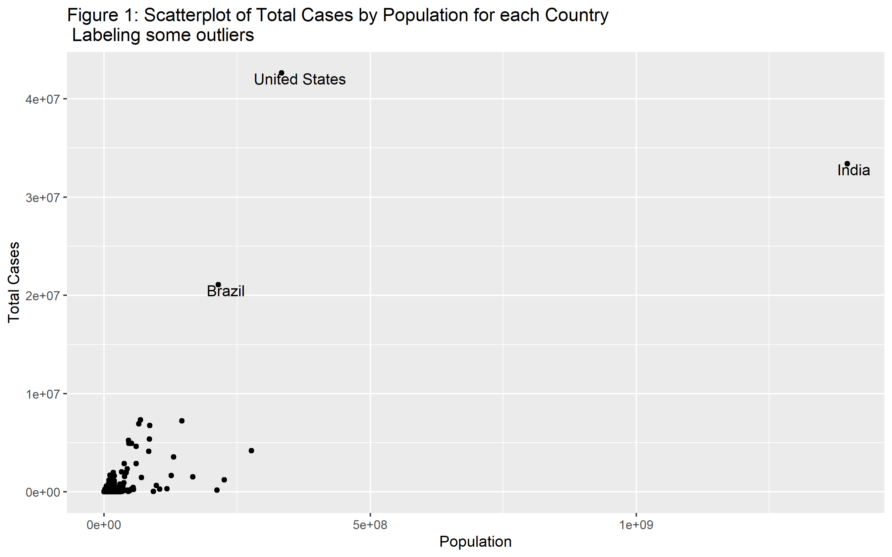
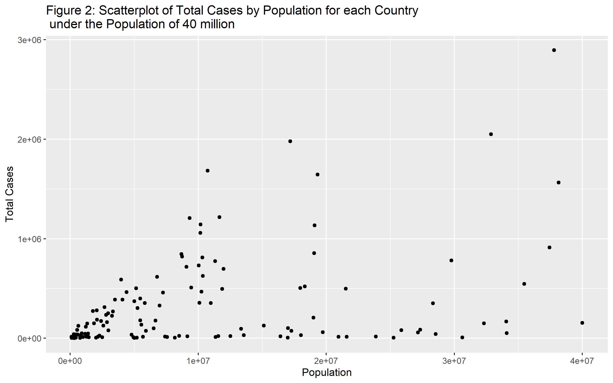
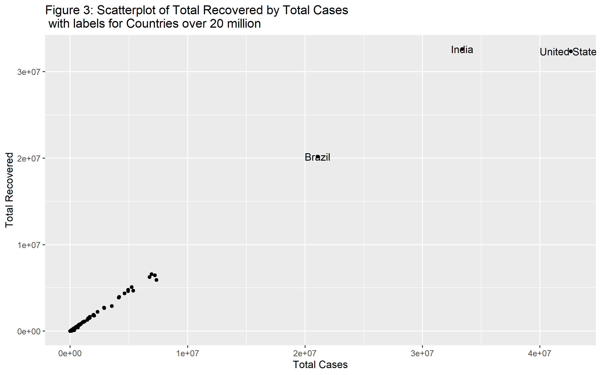
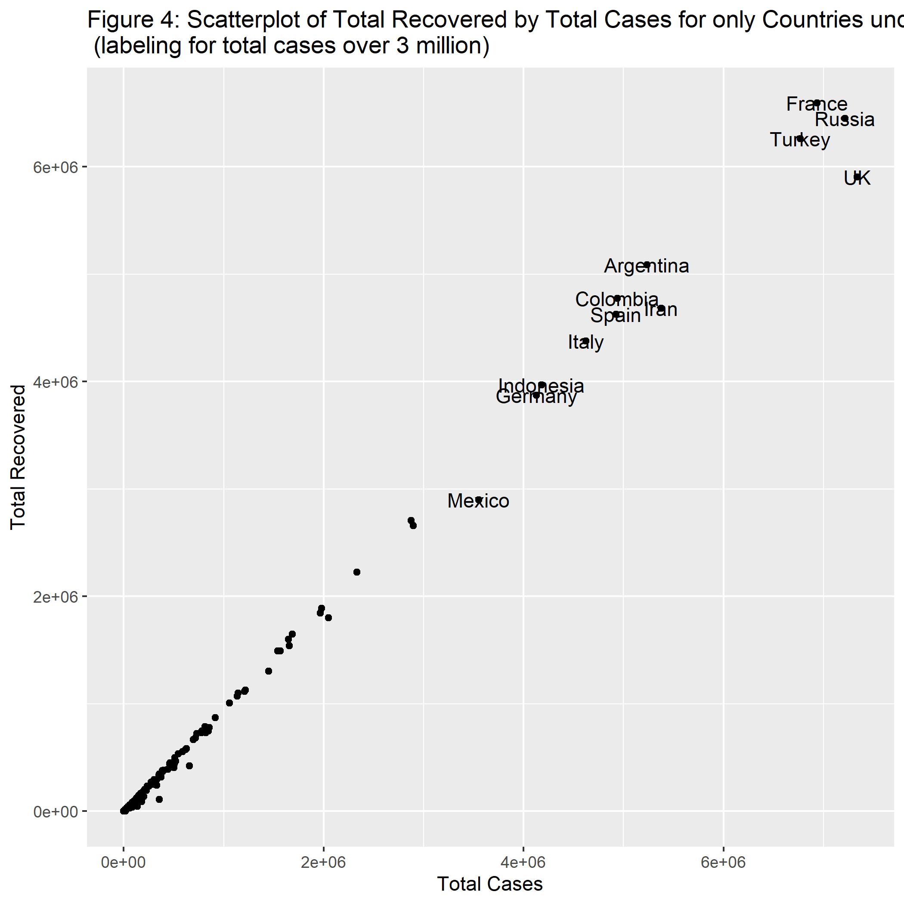
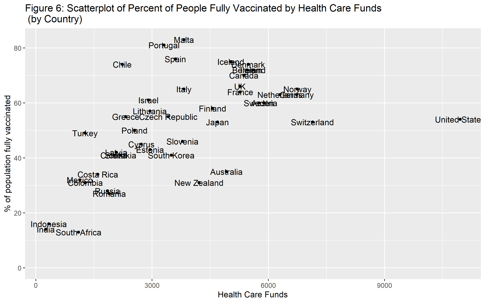
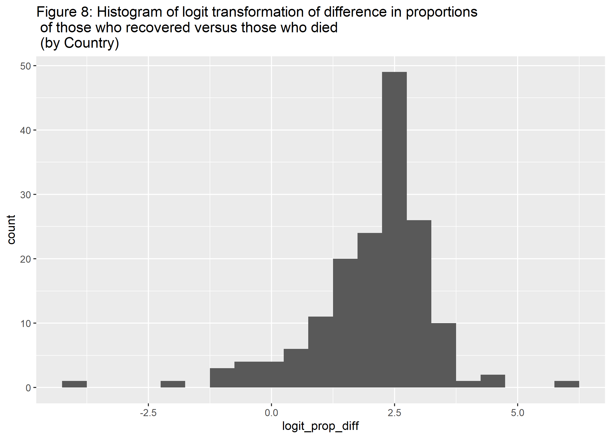
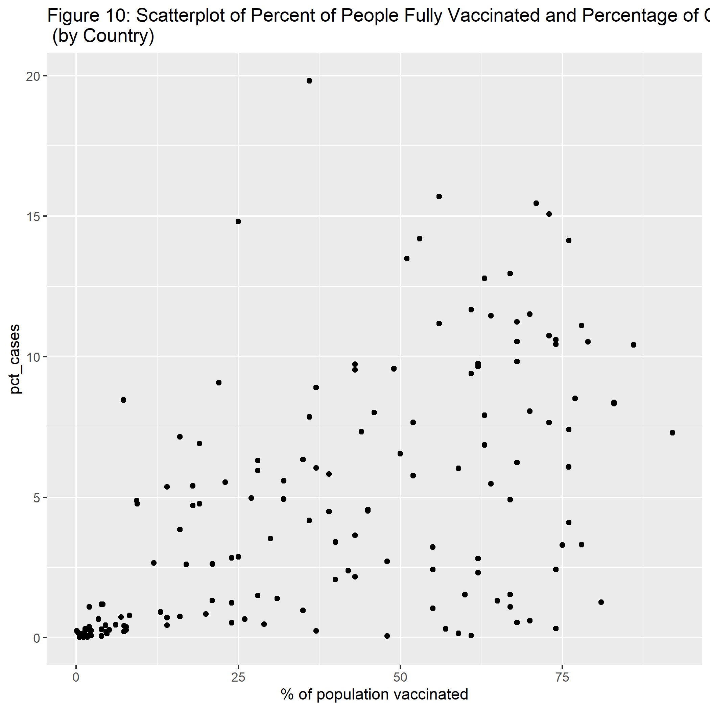
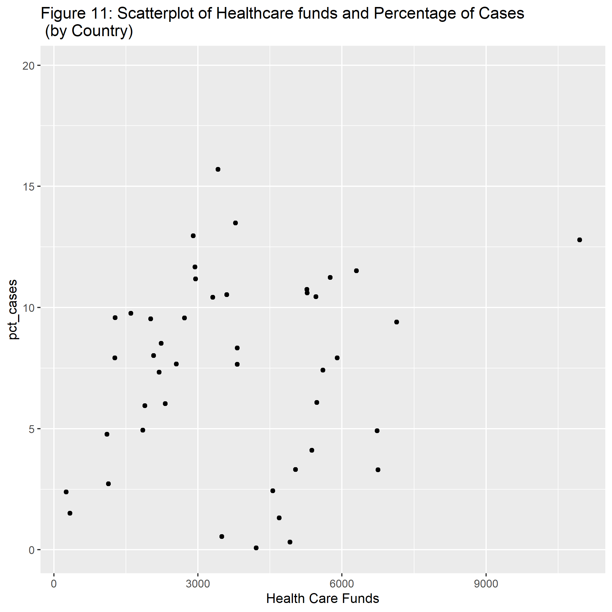
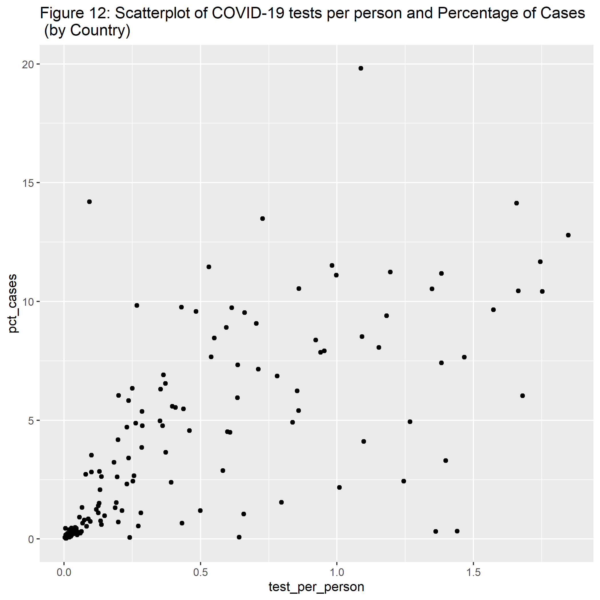
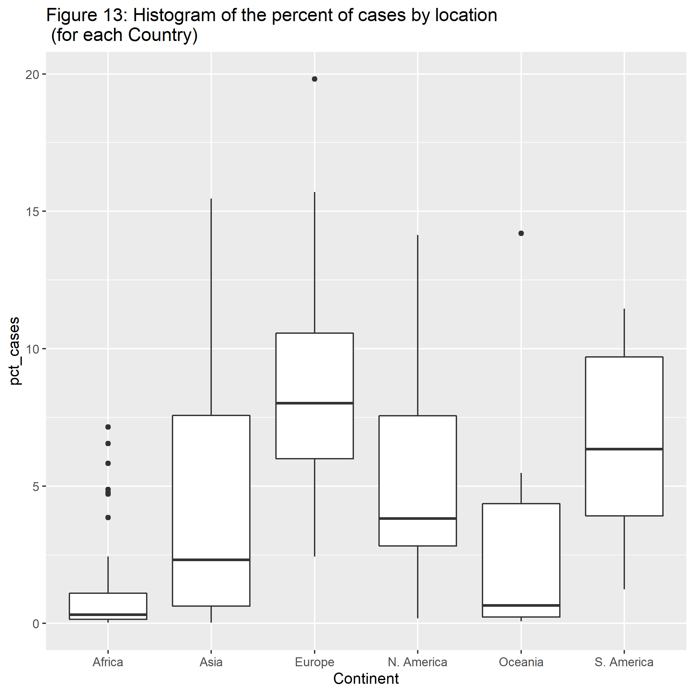

A table summarizing the data.


```{r summarytable,  echo=FALSE}
resulttable=readRDS("../../results/summarytable.rds")
knitr::kable(resulttable, caption = 'Data summary table.')
```

A table of the top 10 countries with the highest percentage of cases by population. We can see that there are a variety of locations and that Montenegro and Czech Republic are the highest 2 countries with the most cases by population.


```{r table1,  echo=FALSE}
tab1=readRDS("../../results/table1.rds")
knitr::kable(tab1)
```

A table of the top 5 and bottom 5 recovery rates also sharing the total cases numbers.It looks that Asia dominates the top 5 countries for recovery rate. For the bottom 5, there is a mixture of locations. We can also see that the recovery rate and death rate for the bottom 5 teams do not add up to 100 or close to it. This means there are a lot of active cases. 


```{r table2,  echo=FALSE}
tab2=readRDS("../../results/table2.rds")
knitr::kable(tab2)
```

A table  of the top 5 and bottom 5 countries for death rate. We can see that Vanuatu only has a total of 4 cases but Yemen also has a significantly large rate then the next top country, Mexico. We can also see that Asia dominates the lowest death rates. 


```{r table3,  echo=FALSE}
tab3=readRDS("../../results/table3.rds")
knitr::kable(tab3)
```


A scatterplot figure  of total cases by population. United States, India, and Brazil are some outliers of the countries.

```{r figure1,  fig.cap='Analysis figure.', echo=FALSE}

```

A scatterplot figure of total cases by population filtered down to countries with less than 40 million population. We can see that the total cases are spread out. 

```{r figure2,  fig.cap='Analysis figure.', echo=FALSE}

```

A scatterplot figure of total recovered patients by total cases. We can see just like in figure 1 that the United States, India, and Brazil have a overwhelmingly more cases than other countries. Therefore in figure 4, we will explore the majority of the countries.

```{r figure3,  fig.cap='Analysis figure.', echo=FALSE}

```

A scatterplot figure of the same plot as before just filtering countries with less than 20 million cases. We can see a linear relationship between the recovered to total cases. It looks like a slope of 1. 

```{r figure4,  fig.cap='Analysis figure.', echo=FALSE}

```


A scatterplot figure of percent of people fully vaccinated by health care funding. We can see that it is a linear relationship with a positive correlation. We can also see that the United States is out of the norm where they spend a lot more on health care funding compared to the percent of people fully vaccinated. 

```{r figure6,  fig.cap='Analysis figure.', echo=FALSE}

```

A histogram figure of the percentage of cases per population. We can see that this data is highly skewed to the right.

```{r figure8,  fig.cap='Analysis figure.', echo=FALSE}

```


We can see with looking at figure 5 that the percentage of cases are roughly bimodal or even right skewed. For now, I will proceed with doing some simple linear regression. Below shows model statistics for each model and a visual showing the relationship between the two variables.

Figure 10 is showing statistics for the predictor percentage of cases.
```{r vaccine pct,  echo=FALSE}


tab9=readRDS("../../results/tablepctcases2.rds")
knitr::kable(tab9)
```

Figure 11 is showing statistics for the predictor health care funds.
```{r health care,  echo=FALSE}


tab10=readRDS("../../results/tablehc2.rds")
knitr::kable(tab10)
```

Figure 12 is showing statistics for the predictor number of tests per person.
```{r Tests,  echo=FALSE}


tab11=readRDS("../../results/tabletests2.rds")
knitr::kable(tab11)
```

Figure 13 is showing statistics for the predictor location which specifies the continent for each country.
```{r Location,  echo=FALSE}


tab12=readRDS("../../results/tableloc2.rds")
knitr::kable(tab12)
```
