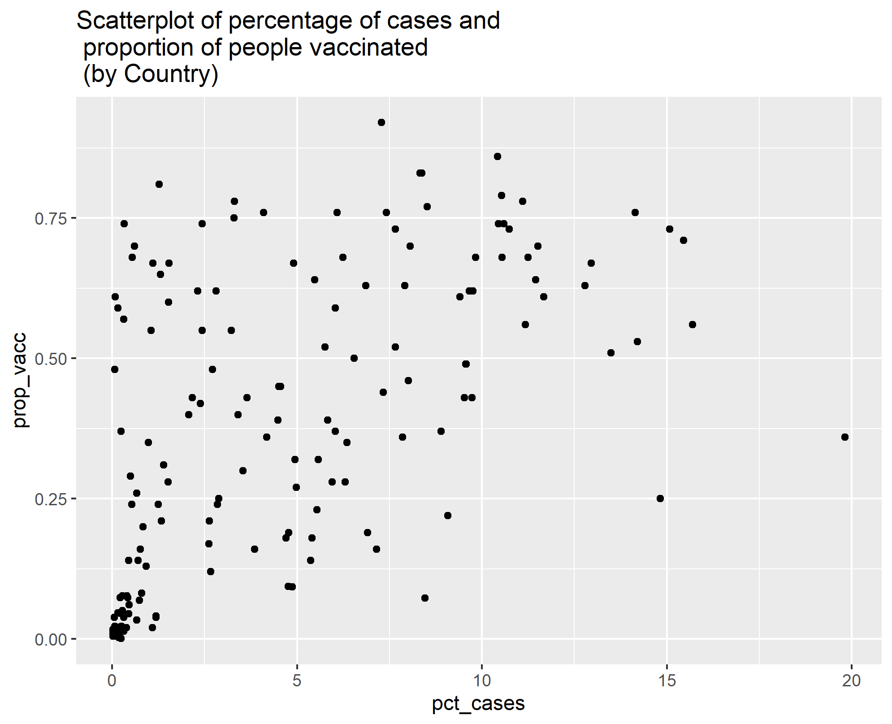

This document displays some supplemental material to the analysis. 

**Supplemental material for question 1**

This table is showing statistics for the simple linear regression between the predictor health care funds with the outcome being the logit transformation of the proportional difference between recovery and death rates. This is supplemented for table 1.2.

This helps describe that no predictors are good in predicting the outcome with a low R-squared.

```{r table regr for hc,  echo=FALSE}
tab3=readRDS("../../results/supp_mat/tablehc1.rds")
knitr::kable(tab3)
```

This table is showing statistics for the simple linear regression between the predictor number of tests performed with the outcome being the logit transformation of the proportional difference between recovery and death rates. This is supplemented for table 1.2.

This helps describe that no predictors are good in predicting the outcome with a low R-squared.

```{r table regr for tests,  echo=FALSE}
tab4=readRDS("../../results/supp_mat/tabletests1.rds")
knitr::kable(tab4)
```

This table is showing statistics for the simple linear regression between the predictor location, which is the continent each country is associated with, with the outcome being the logit transformation of the proportional difference between recovery and death rates. This is supplemented for table 1.2.

This helps describe that no predictors are good in predicting the outcome with a low R-squared.

```{r table regr for loc,  echo=FALSE}
tab5=readRDS("../../results/supp_mat/tableloc1.rds")
knitr::kable(tab5)
```


**Supplemental material for question 2**

This table is showing statistics for the simple linear regression between the predictor percentage of cases with the outcome being the logit transformation of the proportion of people vaccinated. 

```{r vaccine pct,  echo=FALSE}
tab9=readRDS("../../results/supp_mat/tablepctcases2.rds")
knitr::kable(tab9)
```

This table is showing statistics for the simple linear regression between the predictor GDP per capita with the outcome being the logit transformation of the proportion of people vaccinated. 

```{r health care,  echo=FALSE}
tab10=readRDS("../../results/supp_mat/tablegdp2.rds")
knitr::kable(tab10)
```

This table is showing statistics for the simple linear regression between the predictor number of COVID-19 tests per person with the outcome being the logit transformation of the proportion of people vaccinated. 

```{r Tests,  echo=FALSE}
tab11=readRDS("../../results/supp_mat/tabletests2.rds")
knitr::kable(tab11)
```

This table is showing statistics for the simple linear regression between the predictor location which is the continent with the outcome being the logit transformation of the proportion of people vaccinated. 

```{r Location,  echo=FALSE}
tab12=readRDS("../../results/supp_mat/tableloc2.rds")
knitr::kable(tab12)
```


This figure shows that there is no trend between vaccinations and cases until you get out to over 10% of the population had cases of COVID-19. The vaccination numbers range a lot when there is a low perecentage of cases compared to the countries population.  

```{r case vs vacc, echo=FALSE}

```


This figure shows the tuning process in a visual. The best model is represented by the lowest RMSE within the dip. 

```{r tune process, echo=FALSE}

```


